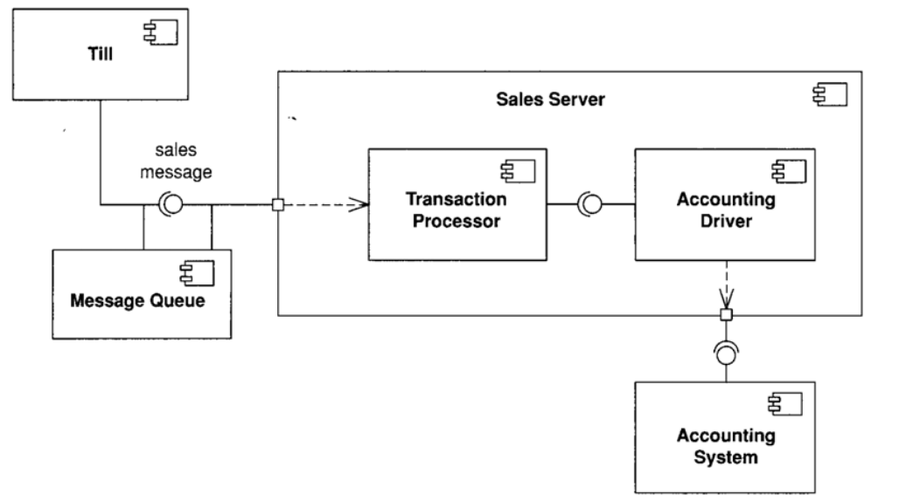
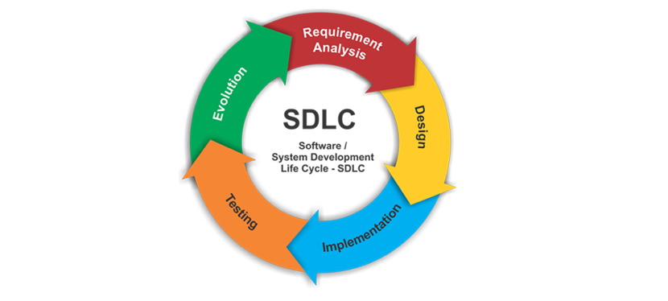

## شرح آزمایش

* در هر مرحله از ایجاد، ابتدا واسط‌ها را تعریف می‌کنیم. سپس تست‌ها را می‌نویسیم. حال، پس از مشخص شدن تست‌ها، قسمت‌ها را ایجاد می‌کنیم. آنقدر مرحله‌ی ایجاد را جلو می‌بریم تا همه‌ی تست‌ها پاس شوند.

### ایجاد مستطیل
در این مرحله، نیاز است یک کلاس مستطیل تعریف کنیم که یک طول و عرض دریافت می‌کند و می‌تواند مساحت را خروجی دهد. در نتیجه، واسط‌های آن به صورت زیر است.

```python
class Rectangle:
    def __init__(self, width: float, height: float):
        pass

    def compute_area(self) -> float:
        pass
```

باتوجه به واسط مورد نظر، هر تست شامل پارامترهای (طول و عرض) و مساحت مورد انتظار است. 

برای پیدا کردن حالت‌های تست، از روش‌ مبتنی بر واسط "همه‌ی ترکیبات" استفاده کردیم. ابتدا هر پارامتر ورودی را حالت‌بندی کردیم: (کوچکتر از ۰، برابر صفر، بزرگتر از صفر). باتوجه به حالت‌بندی، ۹ حالت تست پیدا کردیم تا کل فضا را پوشش دهد. سپس، به این فکر افتادیم وضعیت دو ورودی نسبت به هم ممکن است باعث خطا شود. در نتیجه، این را هم حالت‌بندی کردیم. نتیجتا ۱۳حالت تست پیدا کردیم تا کل فضای ورودی را پوشش دهد. پس از پیدا کردن فضاها، کد تست کردن کلاس مستطیل را نوشتیم.

پس از نوشتن تست، شروع به ایجاد کلاس مستطیل کردیم. آنقدر ایجاد را جلو بردیم تا همه‌ی تست‌ها برآورده شوند.


### افزودن متدهای get, set
برای افزودن متدهای get, set به کلاس مستطیل، از ویژگی `property` در پایتون استفاده کردیم. در نتیجه، واسط‌های اضافه شده به کلاس مستطیل به صورت زیر هستند.

```python
class Rectangle:
    @property
    def width(self):
        pass

    @width.setter
    def width(self, value: float):
        pass

    @property
    def height(self):
        pass

    @height.setter
    def height(self, value: float):
        pass
```

باتوجه به واسط‌های اضافه شده، برای تست این قسمت، نیاز به پارامترهای (طول و عرض) جدید داریم، و همینطور مساحت مورد انتظار جدید. از آنجا که ویژگی‌های مورد نیاز این قسمت مشابه قسمت قبل بود، و قسمت قبل کل فضای حالت را پوشش می‌داد، برای این قسمت حالت تست جدیدی ایجاد نکردیم. به‌جای آن، برای هر حالت تست یک عدد تصادفی در حدود تعداد تست‌ها ایجاد کردیم. سپس، برای هر حالت تست قبل، ابتدا یک مستطیل با ورودی‌های پیشین می‌سازیم و سپس باتوجه به عدد تصادفی تولید شده، آن مستطیل را به حالت جدید تبدیل می‌کنیم و دوباره مساحت آن‌را تست می‌کنیم. با این تست، می‌توان گفت تقریبا همه‌ی حالات پوشش داده شدند.

پس از ایجاد تست‌ها، واسط‌های مورد نظر را پیاده‌سازی کردیم.

### تغییر در فرآیند ساخت مستطیل
در مرحله‌ی دوم ایجاد، به فکر یک واسط جدید افتادیم، که غنای معنایی زیادی داشت. به این فکر افتادیم که یک مستطیل با ابعاد کوچکتر از صفر نمی‌تواند وجود داشته باشد. در نتیجه، اگر چنین ورودی‌ای داده شد، باید یک خطا مطرح شود. رو این حساب، بر آن شدیم یک ویژگی جدید به برنامه اضافه کنیم.

برای نوشتن این حالت تست، از همان تست‌های قبلی استفاده کردیم. فقط یک ویژگی جدید به حالت تست اضافه کردیم، که نشان می‌داد آیا این حالت تست به خطا منجر می‌شود یا خیر. سپس قسمت تست ایجاد خطا شدن را پیاده‌سازی کردیم. نیاز است در هنگام اجرای فرآیند get, set هم این وقوع خطا رخ دهد. در نتیجه، در آن‌جا هم این مسئله را تست کردیم.

پس از پیاده‌سازی تست‌ها، این ویژگی را در برنامه پیاده‌سازی کردیم. 

چون قسمت تست زیادی شلوغ شده‌بود، آن را بازآرایی کردیم. برای بازآرایی آن قسمت، برای هر حالت تست یک کلاس درست کردیم و کلاس‌ها از یک کلاس انتزاعی ارث می‌بردند. تست کننده‌ی برنامه عموما با آن کلاس انتزاعی کار داشت، به جز مواقعی که دقیقا نیاز بود حالت‌های مجازی که منجر به وقوع خطا نمی‌شوند، تست شوند. حواسمان بود در این ساختار توارثی کلاس‌ها، اصل LSP, OCP برقرار باشد. هر کلاس عینی حالت تست، دقیقا می‌توانست جای کلاس انتزاعی قرار بگیرد و قراردادهای آن کلاس را برآورده کند. همچنین، دقیقا توابعی که باعث چندریختی کلاس‌ها می‌شدند را انتزاعی کردیم. باتوجه به رعایت این اصول، جفت‌شدگی کمتر شده و باعث رعایت بیشتر اصل OCP می‌شود.

### ایجاد مربع
در مرحله‌ی ایجاد مربع، برای رعایت اصول LSPو OCP نیاز شد تا ساختار توارثی را تغییر دهیم. باوجود اینکه در هندسه مربع نوعی مستطیل است، رفتار محاسباتی و ویژگی‌هایی که مربع دارد، با مستطیل یکسان نیست، و تنها وجه اشتراک این دو در وجود مساحت برای این دو است. از این جهت، یک کلاس جدید انتزاعی به نام Shape درست کردیم، که تابع انتزاعی `compute_area` را داراست. پس از ساخت این کلاس، کلاس‌های مستطیل و مربع آن‌را به ارث می‌رسانند. در نتیجه، واسط کلاس مربع به صورت زیر می‌شود.
```python
class SquareInterfaceForTest(Shape):
    def __init__(self, side: LENGTH_TYPE):
        pass

    @property
    def side(self):
        pass

    @side.setter
    def side(self, value: LENGTH_TYPE):
        pass
```
سپس برای این واسط‌ها تست نوشتیم. تست‌ها را مثل تست‌هایی که برای مستطیل نوشتیم. از آنجا که برای مربع فقط یک پارامتر ضلع داریم، براساس روش ACoC فضای حالت شامل شروط (<0, =0, >0) برای این ضلع است. دو تا از این شروط یک مقدار غیر مجاز هستند، و شرط دیگر هم مجاز است که باید مساحت مربع در آن حالت درست محاسبه شود. حال، بعضی از این حالات را هم گسترش دادیم، برای مثال، حالت کوچکتر از صفر را دو تست برایش نوشتیم. به این صورت، تست‌هایمان از ۳عدد بیشتر شده و برای رفتارهای قابل تست مختلف، حداکثر ۶تست نوشتیم. تست‌ها را در پوشه‌ی `tests`  و در فایل مربوطه می‌توانید مشاهده کنید.

سپس به پیاده‌سازی توابع مورد نیاز پرداختیم، تا تمامی تست‌ها پاس شوند.

### *بازآرایی کلی
برای رعایت اصل DIP و همچنین ISP در کدها، تصمیم گرفتیم رابطه‌ی بین تست‌ها و کدها را غیر مستقیم کنیم. از این جهت، برای هر کلاس یک‌سری واسط تعریف کردیم، به طوریکه کدها آن‌ها را پیاده‌سازی می‌کنند و تست‌ها از  آن‌ها استفاده می‌کنند. می‌توانید واسط‌های تعریف شده را در پوشه‌ی `interfaces` مشاهده کنید.

## پرسش‌ها
1. هر یک از پنج اصل SOLID را در دو الی سه خط توضیح دهید.
### اصل یک مسئولیتی (SRP)
اصل SRP از دل انسجام بیرون آمده است. همانطور که می‌‌دانید انسجام بر این مورد تاکید دارد که عملکرد و وظایفی که یک کلاس یا یک ماژول بر عهده دارد، با یکدیگر ارتباط معنایی داشته باشند و در واقع بتوان این وظایف را به عنوان یک مسئولیت (یا راستای) واحد در نظر گرفت.
> یک کلاس فقط و فقط باید یک دلیل برای تغییر داشته باشد...  مسئولیت به نوعی تعریف می‌شود که یک دلیل برای تغییر باشد.\
>  عمو باب 

### اصل جایگزینی لیسکوف (LSP)
اگر بخواهیم به صورت شفاف‌تری این تعریف را بیان کنیم،‌ می‌توانیم دو کلاس فرزند و پدر را در نظر بگیریم. فرض کنید که در قسمتی از پایگاه کد از یک کلاس انتزاعی به عنوان یک واسط استفاده می‌کنیم. در این مورد اگر کلاس‌های فرزند طوری پیاده‌سازی شده باشند که اصل جایگزینی را نقض کنند، در ارتباط کارخواهانِ این کلاس پدر، به مشکل بر خواهیم خورد؛ زیرا خدماتی که پیاده‌سازی‌های فرزند ارائه می‌‌دهند با قراردادی که کلاس پدر تضمین کرده است، تفاوت دارد و این تفاوت منجر به خطا و حالت‌های پیش‌بینی نشده در سمت کارخواهان خواهد شد.\
دو موردی که باید برای رعایت این اصل به آن توجه کنیم:
1. کلاس فرزند نباید پیش‌شرط‌های قوی‌تری نسبت به کلاس پدر داشته باشند.
2. کلاس فرزند نباید پس‌شرط‌های ضعیف‌تری نسبت به کلاس پدر داشته باشند.\
اگر این دو مورد نقض نشود، اصل جایگزینی برقرار است.
### اصل وارونگی وابستگی (DIP)
به طور خلاصه، اصل وارونگی وابستگی را می‌توان در دو نکته زیر دید:
1. ماژول‌های سطح بالا نباید به ماژول‌های سطح پایین وابسته باشند، بلکه هر دو باید به انتزاعات وابسته باشند.
2. انتزاعات نباید به جزییات وابسته باشند، بلکه جزییات باید به انتزاعات وابسته باشند.\
برای اینکه بتوانیم اصل وارونگی وابستگی را رعایت کنیم، باید در میان تمامی ارتباطات بین کلاس‌های عینی از کلاس‌های انتزاعی و یا واسط استفاده کنیم و به زبانی دیگر هیچ دو کلاس عینی نباید به صورت مستقیم با یکدیگر ارتباط داشته باشند، بلکه باید از طریق یک واسط یا یک کلاس انتزاعی از یکدیگر خدمات بگیرند و با یکدیگر همکاری داشته باشند.
### اصل جداسازی واسط (ISP)
بسیار رخ داده است که واسط‌هایی تعریف شده در سیستم، حجیم هستند و ذیل این واسط‌ها یک مجموعه از وظایفی تعریف شده است که عموما منسجم نیستند. این اصل تاکیدش بر این است که باید این واسط‌ها شناسایی شوند و به واسط‌های ریزتر با مجموعه وظایفی منسجم شکسته شوند. در این صورت هر یک از این ریز واسط‌ها می‌توانند به گروه‌ خاصی از کاربران سرویس دهند و نیاز به تجمیع با دیگر واسط‌ها ندارند، زیرا کاربران نباید به صورت اجباری به متد‌هایی که نیاز ندارند، وابستگی پیدا کنند.
> اگر کاربران را جداسازی کرده‌ایم، باید واسط‌هایی که دسته‌‌های مختلف کاربران از آن استفاده می‌کنند را نیز جداسازی کنیم، زیرا کاربران قدرت خود را روی واسط‌ها اعمال می‌کنند و روی آن‌ها تاثیر می‌گذارند.\
> عمو باب 

### اصل باز-بسته (OCP)
> تمامی موجودیت‌های نرم‌افزار (کلاس‌ها، ماژول‌ها، توابع و …) باید پذیرا (نسبت به توسعه‌ی خدماتشان) و بسته (نسبت به تغییر ساختار داخلی‌شان) باشند.\
> عمو باب 

هنگامی که تغییری در یک برنامه ایجاد می‌شود، نباید این تغییر به صورت منتشرشونده به بقیه ماژول‌های وابسته نیز انتشار یابد. اصل OCP توصیه می‌کند که برنامه به نحوی بازآرایی شود که در صورت مواجه شدن با چنین تغییراتی، مجبور به تغییر ماژول‌های مرتبط نباشید. اگر این اصل به درستی اجرا شود، تغییرات در برنامه فقط منجر به افزودن کد‌های جدید می‌شوند و نیاز به تغییر در قسمت‌‌هایی از برنامه که تا به حال به درستی کار می‌کردند، نمی‌باشد. کلید اصلی در دستیابی به این اصل، استفاده از انتزاع  (به خصوص اصل وارونگی وابستگی) است که در بسیاری از زبان‌ها می‌توان از این قابلیت استفاده کرد.

---
2. اصول SOLID در کدام یک از گام‌های اصلی ایجاد نرم‌افزار (تحلیل نیازمندی‌ها، طراحی، پیاده‌سازی، تست و استقرار) استفاده می‌شوند؟ توضیح دهید.

اصول SOLID در ابتدا برای دست‌یابی به یک **طراحی شی‌گرای** خوب معرفی شدند. این اصول در دیگر گام‌های ایجاد نرم‌افزار موضوعیت کمتری دارند.\
به عنوان مثال یکی از راه‌های اصلی دست‌یابی به تعدادی از این اصول (مانند OCP و DIP) استفاده از «واسط» است؛ این در حالی است که واسط در تحلیل شی‌گرای نیازمندی‌ها فاقد موضوعیت است. چرا که شی‌گرایی به ما می‌آموزد در جریان کاری تحلیل، تنها به چیستی مساله بپردازیم فارغ از اینکه در نهایت پاسخ ما به آن مساله به چه صورت است (تحلیل باید به حدی سطح بالا و منتزع باشد که پیاده‌سازی های غیر نرم‌افزاری نیز با استفاده از آن ممکن باشد).

از طرفی لازم به ذکر است که از آنجایی که شی‌گرایی فراکتال است، نمود استفاده از اصول SOLID را در بسیاری از مراحل ایجاد نرم‌افزار شی‌گرا مشاهده می‌کنیم. برای مثال اصل یک‌مسئولیتی در تمام مراحل ایجاد شی‌گرا دارای اعتبار است. کلاس‌های حوزه تحلیل که ماهیت‌های موجود در مساله را نشان می‌دهند (جریان کاریِ تحلیل)، کلاس‌های طراحی که به یک کلاس در محیط پیاده‌سازی نگاشت می‌شوند، سرویس‌های درون یک معماری میکروسرویس، توابع یا کلاس‌های تست، همگی باید اصل یک‌مسئولیتی را برقرار کنند و در سطح انتزاعی که قرار دارند - در مقایسه با دیگر ماهیت‌های هم سطح - باید دارای یک مقصود و دلیل برای تغییر باشند.
به عنوان مثال دیگر به نمودار مولفه‌ی زیر از کتاب UML Distilled - Fowler توجه کنید.

مولفه‌ی Till نیازمند یک سرویس از مولفه‌ی Sales Server است. پیش از توجه به اصل DIP باید این نیازمندی در قالب یک «وابستگی» از سمت Till به Sales Server نمایان می‌شد. اما با توجه به اصل DIP این وابستگی به یک ماژول سوم، یعنی واسطِ میان این دو مولفه، شده. برقراری این اصل به ما این مزیت را داده است که پیاده‌سازی پشت واسط را از دیدِ مولفه Till پنهان کنیم. در حال حاضر Till درخواست خود را روانه‌ی واسط می‌کند و این درخواست در زمان‌های خلوت مستقیما توسطِ Sales Server پاسخ داده می‌شود و در زمان‌های شلوغ ابتدا وارد صفِ Message Queue می‌شود.

در نهایت امروزه صرف کلمه‌ی solid به عنوان یک صفت مطلوب در تمامی وجوه ایجاد نرم‌افزار استفاده می‌شود، حتی اگر زادگاه اصلی آن صرف جریان کاری «طراحی» باشد.

---
3. در چرخه‌ی عمومی ایجاد نرم‌افزار، آزمون نرم‌افزار دیرتر از پیاده‌سازی نرم‌افزار انجام می‌شود، اما در روش TDD تست‌نویسی پیش از پیاده‌سازی شروع می‌شود. آیا این دو مورد با هم تناقضی دارند؟ توضیح دهید.

همانطور که در تصویر بالا - که یکی از چند چرخه‌ی عمومی ایجاد نرم‌افزار است - مشهود است، پس از جریان کاری پیاده‌سازی، فرایند آزمون نرم‌افزار آغاز می‌شود.\
آزمون نرم‌افزار انواع بسیاری دارد که یکی از آن‌ها آزمون خودکار نرم‌افزار است (که در جاوا با JUnit و در پایتون با پکیج‌های unittest و pytest ممکن می‌شود). پیش از TDD تیم‌های ایجاد تمام انواع آزمون نرم‌افزار را پس از پیاده‌سازی هر قطعه - یا در موارد بسیار بدخیم پس از پیاده‌سازی کل نرم‌افزار - انجام می‌دادند. TDD توصیه کرد بخش خودکار آزمون یک نرم‌افزار جز جریان‌کاری پیاده‌سازی باشد، نه آزمون. همچنین پیشنهاد کرد توابع یا کلاس‌های آزمون‌گر پیش از شروع پیاده‌سازی، نوشته شوند. اما باقی انواع آزمون (مانند آزمون رگرسیون، آزمون دود، آزمون تایید کاربر و ...) همچنان پس از جریان کاری پیاده‌سازی انجام می‌شود.\
پس همانطور که مشهود است TDD تنها تدقیقی بر روی چرخه عمومی ایجاد نرم‌افزار ارائه می‌دهد و آن را تغییری نداده و با آن تناقضی ندارد.

---
4. فرض کنید در آزمایش بالا نیازی به تغییر ابعاد مستطیل نداشتیم. آیا در این حالت می‌توانستیم مربع را از مستطیل به ارث ببریم؟ توضیح دهید.

ابتدا به مشخصات دو کلاس مربع و مستطیل توجه کنیم. مربع دو سرویس ارائه می‌دهد: (۱) تغییر ضلع و (۲) دریافتِ مساحت. همچنین مستطیل دو سرویس مقابل را ارائه می‌دهد: (۱) تغییر طول و عرض و (۲) دریافت مساحت. این دو کلاس در سرویس دوم مشترک‌اند و تنها نقطه تفاوت آن‌ها سرویس اول است؛ اگر دقت کنیم در کد فعلی بخش مشترکِ واسط‌های آن‌ها در یک واسط پدر به نام Shape تجمیع شده است.
```python
class Shape(interface.Interface):

    def compute_area(self) -> float:
        pass
```
پس اگر تنها خدماتی که از این کلاس‌ها لازم بود بخش دریافت مساحت بوده باشد، می‌شد مربع را از مستطیل به ارث برد.

```python
class Rectangle:
    def __init__(self, width: LENGTH_TYPE, height: LENGTH_TYPE):
        self._width = width
        self._height = height

    def compute_area(self) -> LENGTH_TYPE:
        return self.width * self.height

    @property
    def width(self) -> LENGTH_TYPE:
        return self._width

    @property
    def height(self) -> LENGTH_TYPE:
        return self._height

class Square(Rectangle):

    def __init__(self, side: LENGTH_TYPE):
        super(Square, self).__init__(side, side)
```
اگرچه اگر مقداری آینده نگری و مدیریت تغییرات داشته باشیم، به علت **احتمال درخواست سرویسِ «تغییر وجوه مستطیل»** ارث‌بری مربع از مستطیل را انجام نخواهیم داد.